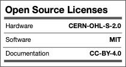

# museduino
an open source electronics environment for exhibits

Docs: <a href="https://museduino.org">museduino.org</a>

## PCB design files and Schematics

All files are under <a href="https://github.com/CTDL/museduino/tree/master/hardware">hardware</a>  folder and subdivided by PCB design software.

ExpressPCB folder contains versions 2.2 and below. Kicad folder is organized by board name contains its own versions (3.0 or greater).

View changelog.md for further information on changes between versions.

## Tutorials and Circuit Diagrams
Content for workshops and museduino guides can be found under 
<a href="https://github.com/CTDL/museduino/tree/master/tutorials">tutorials</a> folder.

## Solder Instructions
Component guides and step-by-step instructions coming soon.
<a href="https://github.com/CTDL/museduino/tree/master/solder-instructions">solder-instructions</a> folder.

## Open Source
Museduino 4.0 is certified as OSHWA-compliant open source hardware.
<a href="https://certification.oshwa.org/us002128.html">certification.oshwa.org/us002128.html</a>

## License

